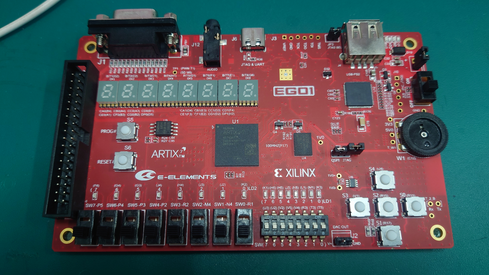

# 南京理工大学《数字系统综合设计》

## 课程

这是南京理工大学电子信息工程大三实验课《数字系统综合设计》的作业

我的老师是王建新

## 实验要求

- 学号显示
- 开关输入的频率值显示
- 正弦信号产生，频率为输入的频率
- 正弦信号频率测量
- 提高部分：蓝牙设置频率（未完成，因为我连不上那蓝牙模块，CC2541芯片，蓝牙名称MLT-BT05，密码123456，但我各种蓝牙串口app连不上）
- 发挥部分（做了xdac，右边电位器输入的频率设置，不过不完善）
- 实验报告

## 实验平台

FPGA板子：EGO1

## 软件

Vivado2019